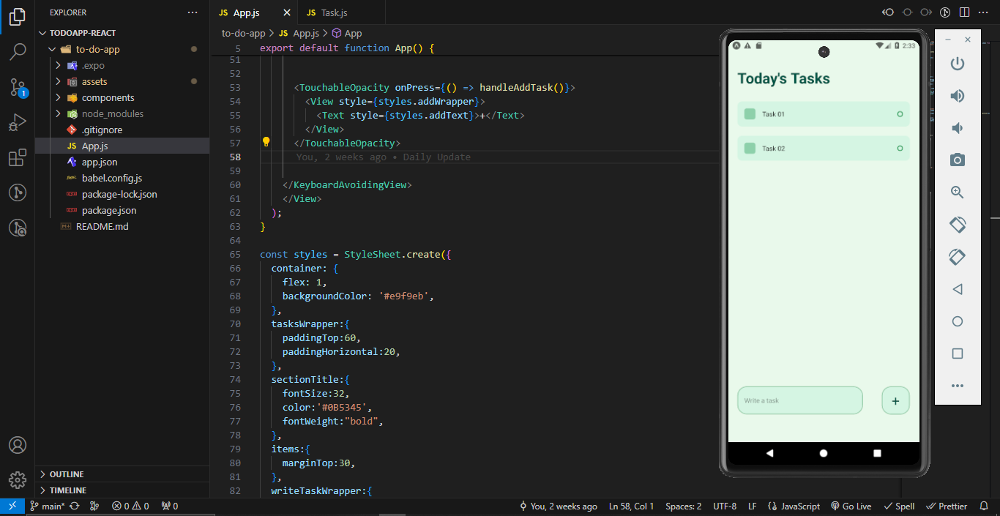

<h1 align='center'>To Do App -React</h1>

A simple ToDo app built using React Native. This app allows users to create, manage, and delete tasks for better organization and productivity. Features include:
  
 - Add new tasks with ease
 - Mark tasks as completed
 - Delete tasks when they're no longer needed
 - Intuitive and user-friendly interface

<h2>Getting Started</h2>

To get started with the ToDo app, follow these steps: 
  1. Clone this repository. 
  2. Install dependencies using 'npm install'. 
  3. Run the app on your preferred platform using 'npm start'. 
  4. Start adding and managing your tasks! 

<h2>Technologies Used</h2>

A simple ToDo app built using React Native. This app allows users to create, manage, and delete tasks for better organization and productivity. Features include:
  
 - React Native
 - JavaScript

<h2>Screenshots</h2>

